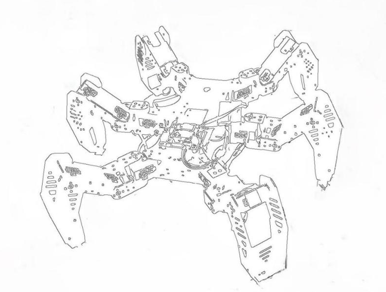
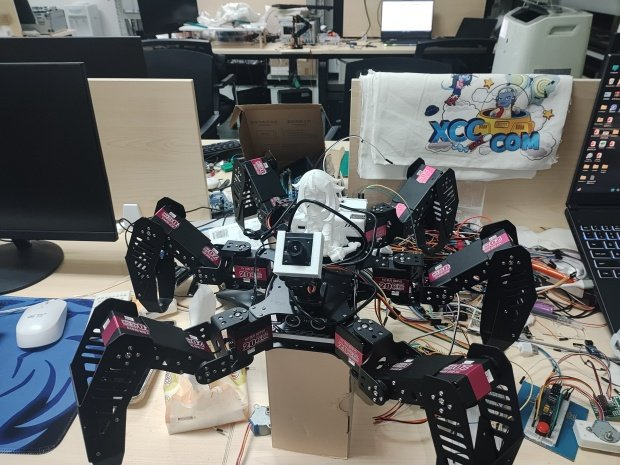
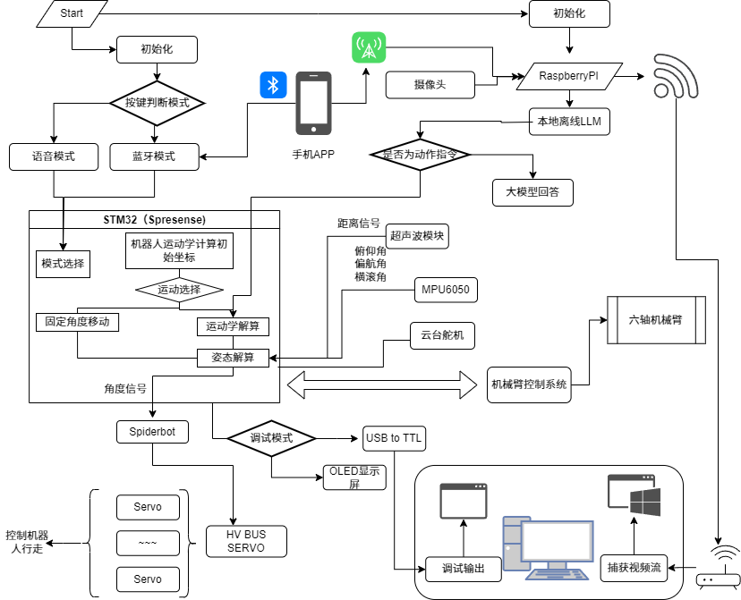

# Hexapod Robot for Natural Disaster Exploration  

## Abstract  

Hexapod robots play an essential role in natural disaster exploration due to their unique flexibility and stability. Traditional manual investigations carry risks in the complex and ever-changing environments following disasters. In contrast, hexapod robots can safely and effectively conduct on-site investigations, ensuring the safety of rescue workers and reducing the potential for casualties.  

The multi-legged design of hexapod robots enables them to traverse various terrains, adapt to narrow, bumpy, or uneven ground, and quickly explore post-disaster areas to collect critical information. Equipped with cameras, temperature detectors, gas sensors, and other tools, these robots can comprehensively assess environmental conditions and provide an accurate basis for rescue efforts. Furthermore, they offer valuable data for post-disaster reconstruction by continuously monitoring environmental changes and preemptively warning of potential dangers.  

## Main Functions  

1. **Bluetooth Remote Control**:   
   - The operator can remotely control the robot's movements using a mobile phone or remote control via the Bluetooth module, improving operational flexibility and distance.  

2. **Voice Control**:   
   - The voice module allows users to issue commands to the robot through natural language, simplifying operations and enhancing the user experience.  

3. **Adjustable Posture**:   
   - The robot's posture is adjustable based on feedback from the MPU6050 sensor, improving maneuverability.  

4. **Local LLM Model for Analysis**:   
   - A local large language model (LLM) is employed for data analysis, while a larger model is used to respond to user inquiries. If an analysis suggests an action command, it is relayed to the main control board for execution.  

5. **Ultrasonic Obstacle Avoidance**:   
   - Ultrasonic sensors enable real-time obstacle detection, allowing the robot to automatically adjust its path and enhance the safety of autonomous navigation.  

6. **Real-Time Image Transmission**:   
   - A Raspberry Pi camera transmits images in real time, facilitating remote environmental monitoring and improving operational efficiency.  

These features make the hexapod robot an efficient and safe tool for disaster exploration, significantly aiding rescue operations and subsequent reconstruction efforts.  

# 六足预置步态执行引擎

本项目实现了六足机器人预置步态执行引擎，基于预编程动作序列和固定关节角度参数，提供机器人运动学的基础控制功能。项目旨在通过硬编码步态和离线规划的方式，以较低的计算开销实现机器人在结构化环境中的稳定运动，同时也为后续的运动学实时解算版本提供对比和基础参考。

---

## 技术维度对比

| 维度         | Hexapod Preset Gait Execution Engine (六足预置步态执行引擎) | 运动学实时解算版本 (Kinematic)            |
| ------------ | --------------------------------------------------------- | ------------------------------------------ |
| **核心原理**   | 基于预编程动作序列和固定关节角度参数                           | 基于运动学模型实时计算关节角度                    |
| **技术特征**   | 硬编码步态 / 离线规划 / 低计算开销                              | 在线解算 / 动态适应性 / 对算力要求较高                |
| **应用场景**   | 结构化环境 / 固定步态需求 / 适用于资源受限设备                      | 非结构化环境 / 动态地形适应 / 面向高性能计算平台           |
| **名称关键词** | Preset (预置) / Scripted (脚本化) / Execution (执行)          | Kinematic (运动学) / Dynamic (动态) / Solver (解算器) |

---

## 程序框架图

## 项目功能与实现

### 已实现功能

#### 运动学控制框架
- 完成了机器人的运动学执行引擎框架搭建。
- 实现前进、后退、向左平移及向右平移控制。  
  > **注：** 左右平移功能目前存在不足，具体表现为两侧正偏角度不一致，且左右侧的抬起高度存在差异。

#### 自平衡控制
- 实现了机器人原地姿态调整，支持沿前后坐标轴的偏移及绕 Z 轴的旋转。
- 其他六个自由度（特偏量）的调整仍需进一步调试和优化。

#### 外围功能
- 集成 OLED 显示模块，实现实时状态反馈。
- 支持蓝牙控制和语音控制，便于多种场景下的调试与操作。
- 提供详细的调试输出，方便问题定位与性能调优。

### 待完善功能

#### 左右平移功能
- 针对左右两侧正偏角度不同及抬起高度不一致的问题，需优化算法实现更平滑均衡的控制效果。

#### 旋转控制
- 左转、右转功能尚未完善，后续将着重完善机器人的旋转控制逻辑。

#### 自平衡控制
- 除了现有的前后及绕 Z 轴控制，其他六个特偏量的调试仍需持续优化，提升整体姿态稳定性。

---

## 项目展望

未来将围绕以下几个方向持续改进和扩展项目功能：

- **优化运动控制算法**  
  进一步改善左右平移和旋转控制，提升运动平滑性与准确性。

- **完善自平衡机制**  
  针对非结构化环境，优化自平衡控制策略，实现更高水平的动态适应性。

- **扩展外围控制方式**  
  丰富语音及蓝牙交互功能，增强系统的可操作性和用户体验。

- **硬件与软件协同优化**  
  针对资源受限设备进行专门调优，实现低功耗高效运行。